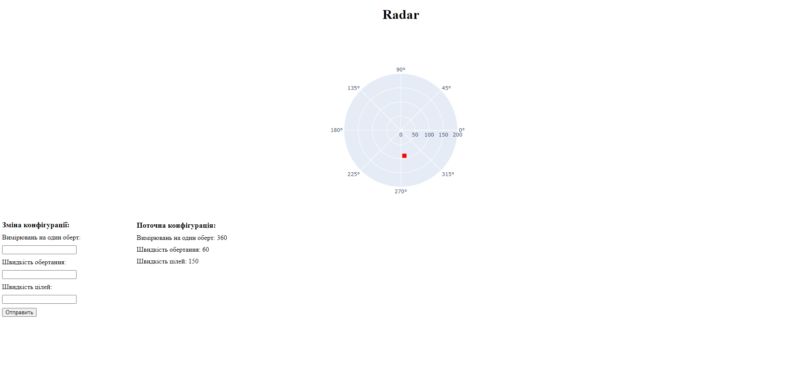
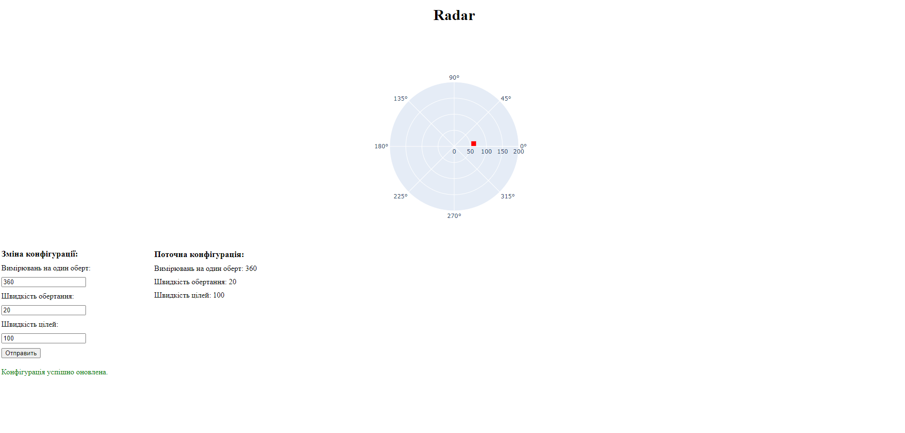
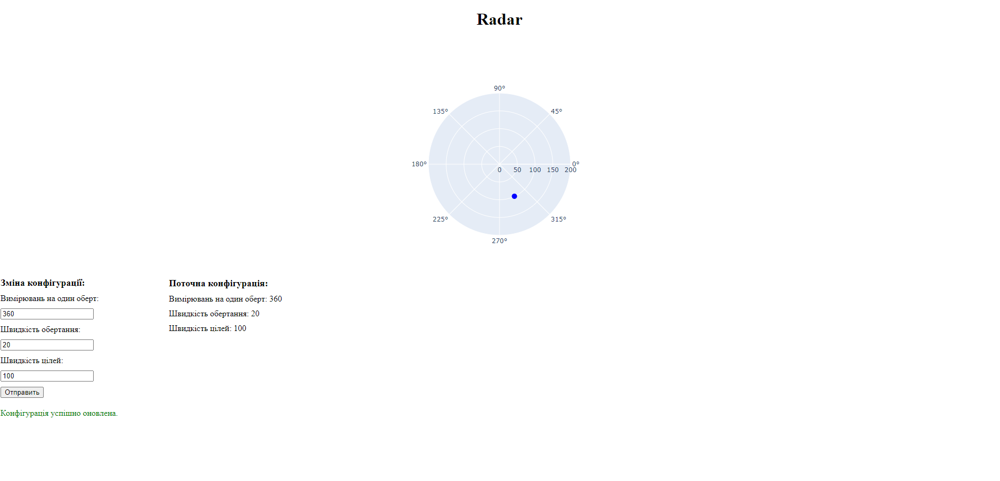

`Ярощук Александр Михайлович ИПЗ 4.04`
## Radar

## Web App
Приложение сделано на python, для отображение графического интерфейса радара.

Так же для изменение конфигурации измерение для радара.

Размер, цвет и форма цели на радаре изменяется в зависимости от уровня сигнала

Для примера было сделано что:
Если уровня сигнала меньше 0.05, то цвет синий, форма круг,
в другом случае цвет красный и форма квадрат.
Размер вычисляется по формуле:
10 + уровня сигнала / 10

